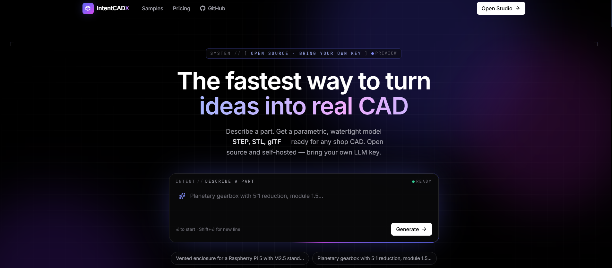
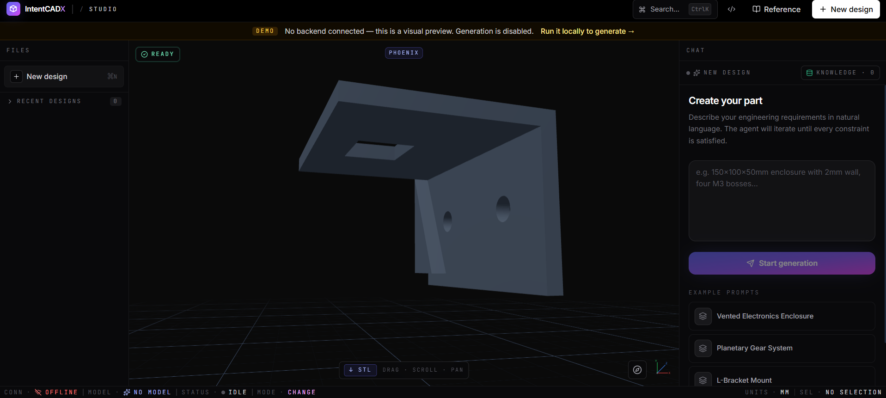
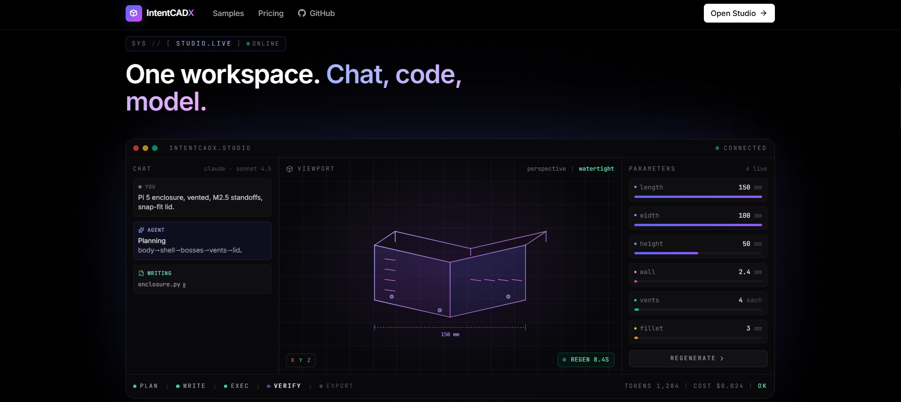
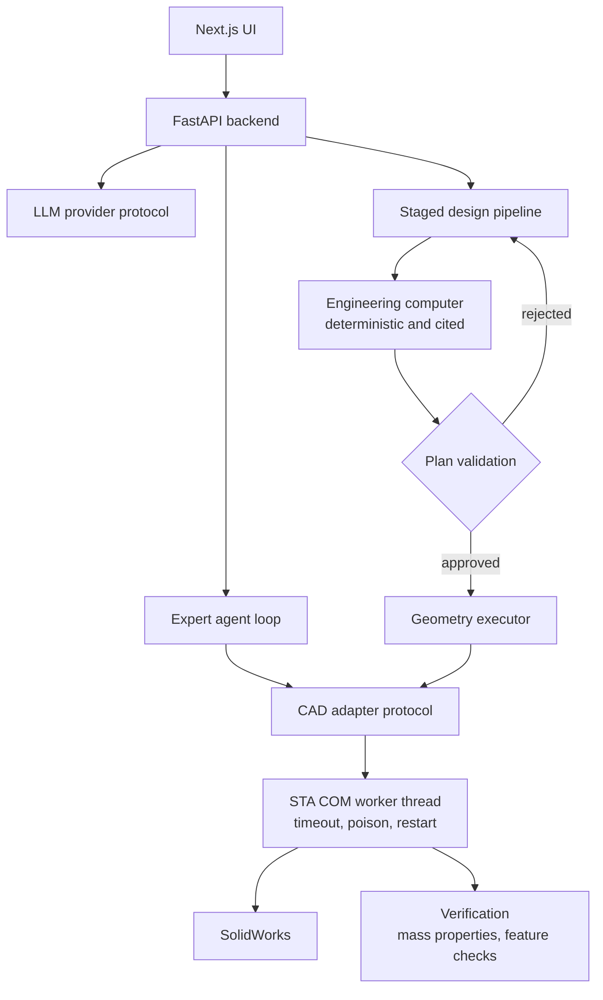

# IntentCADX

Getting an LLM to emit SolidWorks API calls is the easy part — knowing whether the solid it just built is actually the part you asked for is the hard part, so IntentCADX refuses to touch CAD until a typed geometry plan has passed strict validation, then verifies the finished body against mass properties and feature checks.

**Live:** [intentcadx.com](https://intentcadx.com)

## Highlights

- **Single-threaded COM marshalling with timeout and poison recovery.** SolidWorks' `SldWorks.Application` is an STA COM server — every call must come from the thread that initialized that apartment, and when a request crosses threads pywin32 silently hands back degraded `<unknown>` proxies whose members fail. Every COM operation is funnelled through one dedicated worker thread with a queue/Future interface. A stuck modal dialog or COM deadlock can hang an STA call forever, and Python threads can't be force-killed — so a timed-out worker is marked *poisoned*, left blocked as a daemon, and transparently replaced on next use. This is the substrate that lets an async web backend drive a single-threaded desktop application safely. → [`highlights/com_thread.py`](highlights/com_thread.py)

- **Geometric edge identity, because COM object identity lies.** SolidWorks 2026 with current pywin32 started returning methods like `IFace2.GetEdges` as *already-materialized tuples* instead of zero-argument callables; a broad exception suppression swallowed the resulting `TypeError` and turned it into silent "No shared edge" failures. The fix handles both binding shapes explicitly, narrows the catch to `(AttributeError, com_error)` with debug logging, and — since two pywin32 proxies for the same underlying edge are not the same object — switches edge identity to a **geometric key**: endpoint coordinates rounded to 1e-4 mm, direction-invariant, with token and adjacency fallbacks. → [`highlights/semantic_refs.py`](highlights/semantic_refs.py)

- **Plan first, build second — the model never freestyles on the product path.** Instead of letting the LLM emit COM calls, the pipeline forces it to produce a typed `GeometryPlan` that is validated *before* SolidWorks runs, rejecting unsupported operations with structured codes (`unsupported_operation`, `no_tool_mapping`, `incomplete_step`). Geometry rules — through-holes must use pocket-and-circle rather than the Hole Wizard — live in code, not in prompt prose. → [`highlights/plan_validation.py`](highlights/plan_validation.py)

- **The engineering report makes zero LLM calls.** Material resolution, DFM checks, fastener standards, cantilever bending, Marin-modified endurance limits and ISO 281 bearing life are all computed deterministically and carry explicit citations (Shigley §3-3, §5-1, §6-7, §8-7). Every number in the report traces to a formula, not to a generation. → [`highlights/engineering_computer.py`](highlights/engineering_computer.py)

- **1,423 unit tests pass with no SolidWorks installed.** The CAD adapter sits behind a protocol, so the whole pipeline runs against mocks — the suite executes in ~123 s on a machine that has never had a CAD licence.

## Screens

**Studio** — the part description goes in as plain English on the right; the resulting parametric solid is in the viewport, with export and a live connection indicator along the bottom. Generation runs against a locally-hosted backend, so the public build sits in preview mode with generation disabled.

**The pipeline, end to end** — plan, write, execute, verify, export, with the parameters that came out of the description exposed as live values rather than baked into the geometry.

## Architecture

A Next.js UI talks to a FastAPI backend bound to localhost, which is the only component that reaches an LLM provider. A request takes one of two paths. The **staged design pipeline** runs orchestrator → engineering computer → plan validation → deterministic geometry executor → verification, and nothing reaches CAD until the plan is approved. The **expert agent loop** is the iterative path: LLM plus typed `sw_*` tool calls, with persistent tasks, replanning, recovery and cross-run memory. Both bottom out in the same CAD adapter layer, where every COM call is marshalled onto a single dedicated worker thread. LLM providers (Anthropic, OpenAI, OpenRouter, Gemini, plus mock and fallback) sit behind one protocol, and the CAD adapters (SolidWorks primary, FreeCAD secondary) behind another — so the pipeline is testable end-to-end with neither a model nor a CAD seat.

## Stack

`Python · FastAPI · Pydantic · Next.js · TypeScript · SolidWorks COM · C#`

---

This is a showcase repository — a README and four representative source files, not a runnable application. The full source is private.
